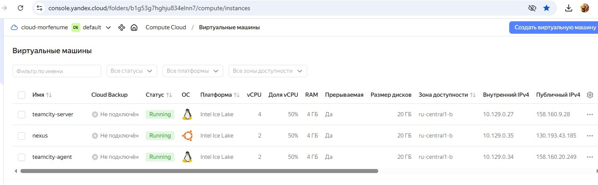
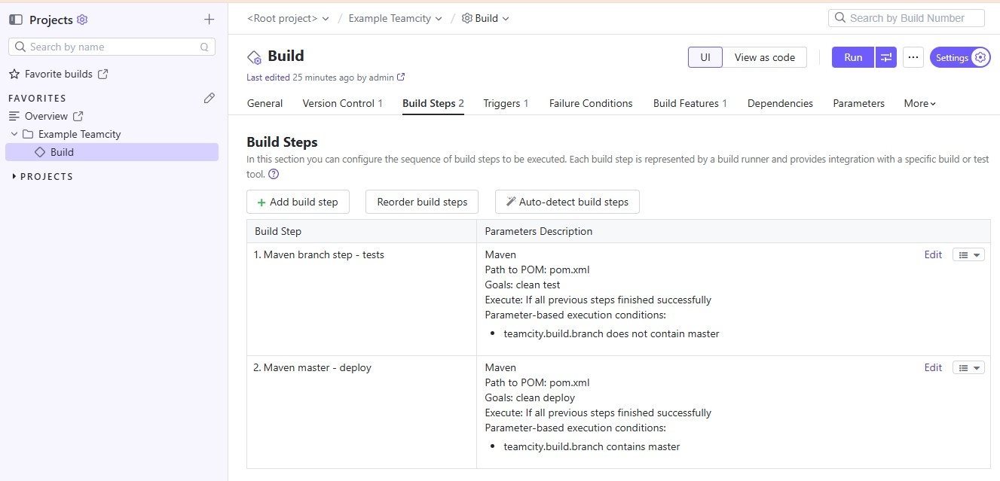
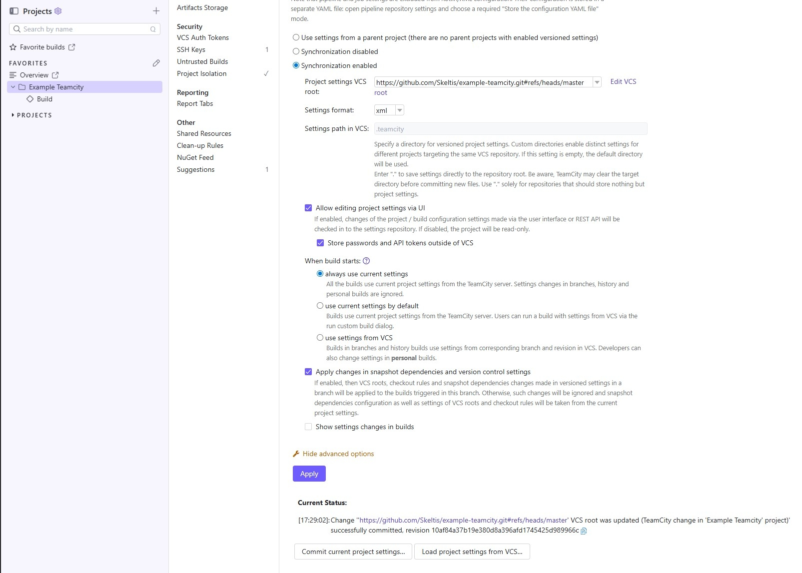
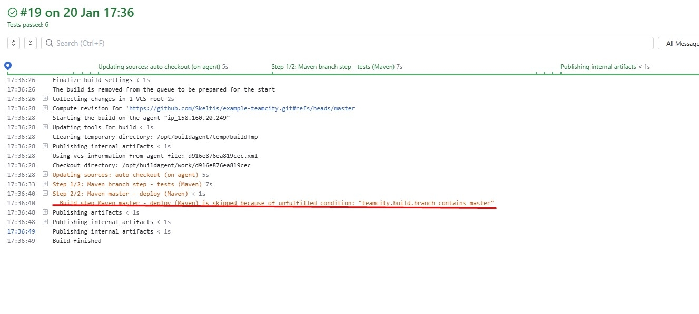
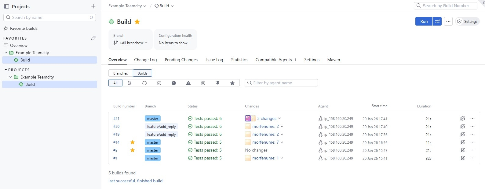
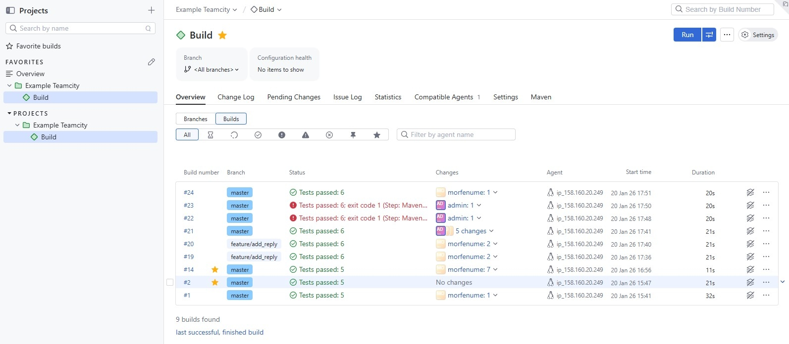
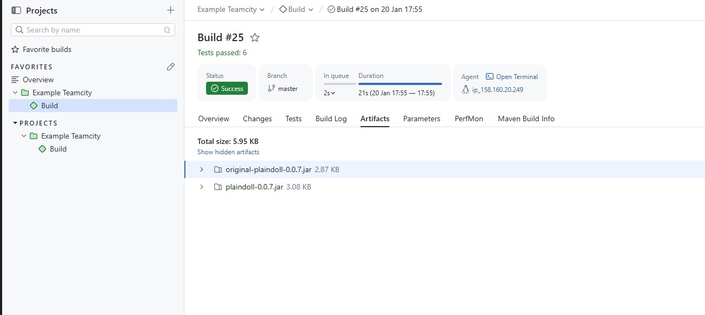
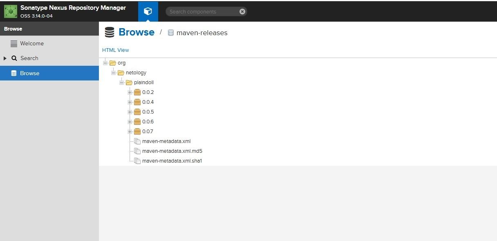

# Домашнее задание к занятию 11 «Teamcity»

## Подготовка к выполнению

## Основная часть

1. Создайте новый проект в teamcity на основе fork.

https://github.com/Skeltis/example-teamcity

2. Сделайте autodetect конфигурации.
3. Сохраните необходимые шаги, запустите первую сборку master.

4. Поменяйте условия сборки: если сборка по ветке `master`, то должен происходит `mvn clean deploy`, иначе `mvn clean test`.

Я воспользовался примером из лекции, но вообще не стал бы настраивать проверку ветки по "contains", т.к. основная ветка может быть и `main`, а ветка с кодом запросто называться как-нибудь `bugfix/fix-maintenance-filter` и будет ложное срабатывание.

5. Для deploy будет необходимо загрузить [settings.xml](./teamcity/settings.xml) в набор конфигураций maven у teamcity, предварительно записав туда креды для подключения к nexus.
6. В pom.xml необходимо поменять ссылки на репозиторий и nexus.
7. Запустите сборку по master, убедитесь, что всё прошло успешно и артефакт появился в nexus.
8. Мигрируйте `build configuration` в репозиторий.

9. Создайте отдельную ветку `feature/add_reply` в репозитории.
10. Напишите новый метод для класса Welcomer: метод должен возвращать произвольную реплику, содержащую слово `hunter`.
11. Дополните тест для нового метода на поиск слова `hunter` в новой реплике.
12. Сделайте push всех изменений в новую ветку репозитория.
13. Убедитесь, что сборка самостоятельно запустилась, тесты прошли успешно.

14. Внесите изменения из произвольной ветки `feature/add_reply` в `master` через `Merge`.

15. Убедитесь, что нет собранного артефакта в сборке по ветке `master`.
16. Настройте конфигурацию так, чтобы она собирала `.jar` в артефакты сборки.

Добавил в конфигурации билда `Artifact paths: target/*.jar`
не заскринил саму конфигурацию, к сожалению

упавшие билды и те, что были почищены - коммиты без апдейта версии и моя борьба за использование апи токена nexus'а вместо логина\пароля, но последнее решил всё-таки не заморачивать. Хотя так было бы правильнее.

17. Проведите повторную сборку мастера, убедитесь, что сбора прошла успешно и артефакты собраны.

18. Проверьте, что конфигурация в репозитории содержит все настройки конфигурации из teamcity.

19. В ответе пришлите ссылку на репозиторий.